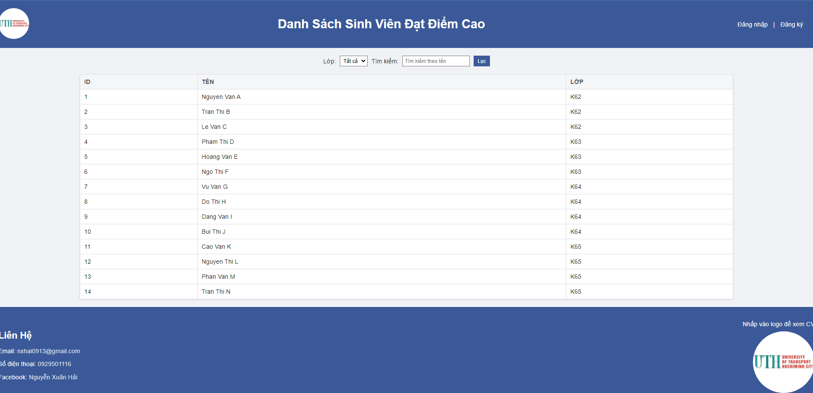
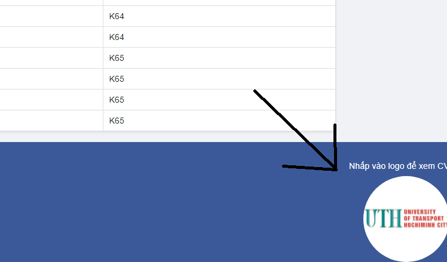

# DAI HOC GTVT HCM Website

## Giới thiệu

Đây là trang web được thiết kế để hiển thị danh sách sinh viên và thông tin liên hệ.

## Website : https://grades-lovat.vercel.app/

## Trang web được xây dựng để cung cấp các tính năng sau:

Hiển thị danh sách sinh viên theo lớp học.

Cho phép người dùng lọc và tìm kiếm sinh viên theo tên.

Cung cấp thông tin liên hệ của trường.

## Các tính năng

Danh sách sinh viên: Trang web hiển thị danh sách các sinh viên của trường với thông tin chi tiết như ID, Tên, và Lớp học.

Lọc và tìm kiếm: Người dùng có thể lọc danh sách sinh viên theo lớp học và tìm kiếm theo tên sinh viên.

Thông tin liên hệ: Phần footer của trang web cung cấp thông tin liên hệ với trường, bao gồm địa chỉ email, số điện thoại và liên kết đến trang Facebook.

## Cài đặt và sử dụng

### Cài đặt:

Clone repository từ GitHub về máy tính của bạn.

Mở file index.html bằng trình duyệt web để xem trang web.

### Sử dụng:

- Chọn lớp học từ dropdown để lọc danh sách sinh viên.

- Nhập tên sinh viên vào ô tìm kiếm để tìm kiếm sinh viên cụ thể.

- Nhấn nút "Lọc" để áp dụng bộ lọc.

- Cung cấp thông tin liên hệ nằm ở phần footer để người dùng có thể liên hệ với trường.

### Công nghệ sử dụng:

HTML5

CSS3

JavaScript (cho các tính năng tương tác như lọc danh sách sinh viên)

## Tác giả

Nguyễn Xuân Hải

